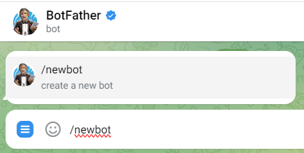
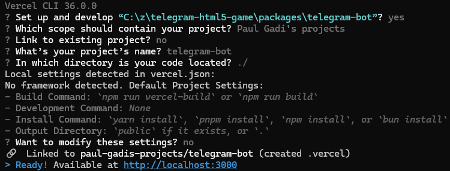
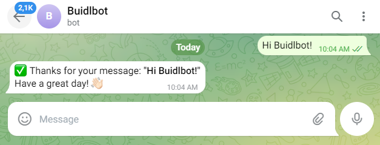
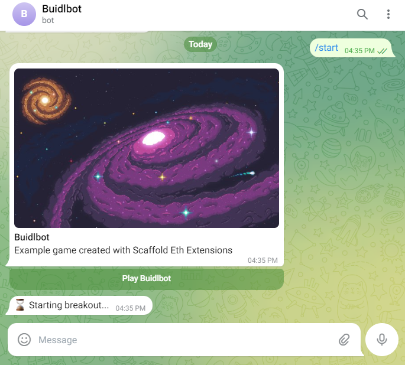

# 🤖 telegram-bot: Telegram HTML 5 Game Extension for Scaffold-ETH 2

## Demo Bot

https://t.me/se2_html5_bot

## Getting Started

Creating an HTML5 game in Telegram requires two components:
* A Telegram bot that is the initial interface for the telegram user
* A hosted HTML5 game that will be run on a webview inside Telegram 

We will also need to configure the Telegram bot to register and start our game. We'll go through the steps to get everything up and running below.

### Prerequisites

* Install [ngrok](https://ngrok.com/)
    *  ```npm install -g ngrok```
    * Set up an ngrok account on [ngrok.com](https://ngrok.com/)
* Install [vercel](https://vercel.com/) cli
    * ```npm install -g vercel```
* Obtain a [Bot Token](https://core.telegram.org/bots/tutorial#getting-ready) from [BotFather](https://t.me/BotFather), the Telegram bot that handles bot registrations. This is usually done via the ```/newbot``` command



### Run Bot Locally

* Create an ngrok tunnel
    * ```ngrok http 3000```
    * retrieve the NGROK_URL from the command line, it should look similar to ```https://dd9b-2607-fea8-85a2-a100-9830-206a-d1d8-9cb1.ngrok-free.app```


* create an ```.env``` file with the bot token and ngrok url
    * **NOTE:** NGROK_URL changes every time the ```ngrok http 3000``` command is run
```
BOT_TOKEN=[retrieved from telegram]
NGROK_URL=[shown on command line]
```

* start the server locally
    * ```vercel dev```



* set the telegram webhook for local testing
    * ```yarn set-webhook-local```

* verify webhook is running
    * ```yarn get-webhook-info```

* Test bot by sending a message on telegram




### Register our Game to Telegram

* Set our bot to inline mode by sending ```/setinline``` to [BotFather](https://t.me/BotFather)
* Register the game by sending ```/newgame```
* Once registered, add the ```short_name``` parameter into the ```.env``` file

```
GAME_SHORT_NAME=[short name registered, for example: breakout]
```
* Start chatting with our bot again and send it ```/start``` and press the Play button. If everything works well you should see a sample breakout game



### Deploy Bot on Vercel

* stop local ngrok tunnel and localhost server
* add ```BOT_TOKEN``` environment variable in vercel project settings 
* deploy app on vercel
  * ```vercel --prod```
* retrieve production url from [vercel](https://vercel.com/) and update .env file
```
VERCEL_ENV=[domain assigned by vercel]
```
* update webhook to production
  * ```yarn set-webhook-prod```

* verify webhook is updated to production url
    * ```yarn get-webhook-info```

* Test bot by sending a message on telegram

### Deploy Self-Hosted Game

See the [telegram-html5-game package](../telegram-html5-game/README.md)