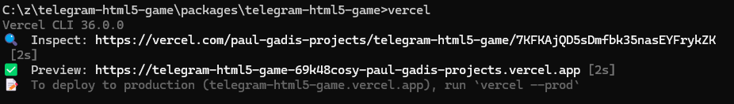

# 👾 telegram-html5-game: Telegram HTML 5 Game Extension for Scaffold-ETH 2

This is the example starter project of [LittleJS](https://github.com/KilledByAPixel/LittleJS)

## Prerequisites

* Install [vercel](https://vercel.com/) cli
    * ```npm install -g vercel```

## Getting Started

* ```vercel dev```

## Deploying on Vercel

* ```vercel```

## Integrating with Telegram Bot

* In the ```telegram-bot``` package [.env file](../telegram-bot/.env.example), Replace the GAME_URL variable with the url provided by Vercel


